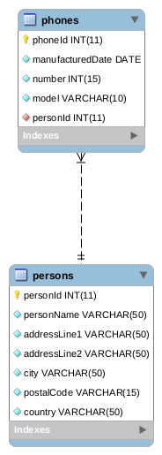

### **Projekt do nauki podstaw JDBC.**

Projekt zakłada istnienie dwóch tabel: Phones i Persons w relacji n : 1.

Poszczególne ćwiczenia są przedstawione jako przypadki testowe
znajdujące się w
[JdbcExercisesIT](src/main/test/pl/jdbc/services/JdbcExercisesIT.java).

#### Konfiguracja połączenia z bazą danych

Konfiguracja połączenia z bazą danych znajduje się w
[MySqlDriver](src/main/java/pl/jdbc/utils/MySqlDriver.java)

#### Konfiguracja kontenera

W celu ułatwienia pracy, w katalogu resources znajduje się plik
[docker-compose](src/main/resources/docker/mysql/docker-compose.yaml)
zawierający konfigurację dla kontenera MySql. Plik
[citizens](src/main/resources/docker/mysql/citizens.sql) inicjalizuje
podstawową strukturę tabel wraz z danymi inicjalizacyjnymi. **Należy
wgrać go ręcznie**.

#### Schemat bazy danych

